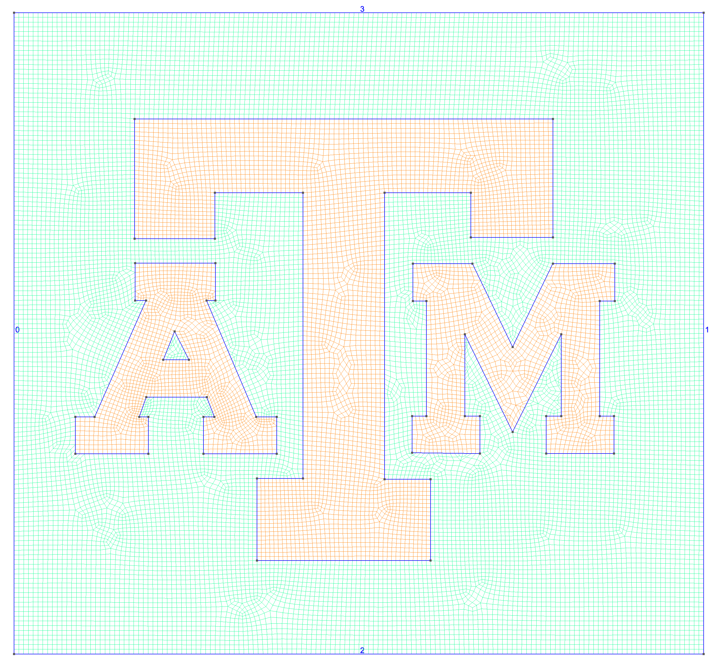

# TAMU ATM Mesh

Meshed block ATM using gmsh as shown in the image below (numbers are the boundary ids/physical lines). `atm.py` does the generation via a listing of points for each geometric object in the `points` folder. Works best with gmsh 3.

